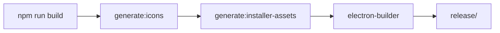

# Plano: Melhoria Visual do Instalador Ditado

## Resumo do Estado Atual

### Configuração Atual do electron-builder
O projeto possui uma configuração básica no [`package.json`](package.json:36):

```json
{
  "build": {
    "appId": "ai.ditado.app",
    "productName": "Ditado",
    "win": {
      "icon": "public/app-icons/icon.ico",
      "target": ["nsis"]
    },
    "mac": {
      "target": ["dmg", "zip"]
    },
    "linux": {
      "target": ["AppImage", "deb"]
    }
  }
}
```

### Assets Existentes
- [`public/app-icons/icon.ico`](public/app-icons/icon.ico) - Ícone Windows
- [`public/app-icons/icon.png`](public/app-icons/icon.png) - Ícone PNG 256x256
- [`public/app-icons/tray.png`](public/app-icons/tray.png) - Ícone da bandeja 32x32
- [`public/favicon.svg`](public/favicon.svg) - SVG fonte com design do microfone

### Script de Geração de Ícones
O script [`scripts/generate-icons.mjs`](scripts/generate-icons.mjs) gera ícones a partir do SVG, mas apenas:
- tamanhos: 16, 24, 32, 48, 64, 128, 256
- formatos: ICO e PNG

---

## Plano de Implementação

### 1. Criar Estrutura de Diretórios build/

```
build/
├── icon.ico              # Ícone principal Windows
├── icon.icns             # Ícone principal macOS  
├── icon.png              # Ícone fonte 1024x1024
├── icons/                # Ícones Linux em múltiplos tamanhos
│   ├── 16x16.png
│   ├── 32x32.png
│   ├── 48x48.png
│   ├── 64x64.png
│   ├── 128x128.png
│   ├── 256x256.png
│   └── 512x512.png
├── installerSidebar.bmp  # Imagem lateral NSIS (164x314 px)
├── installerHeader.bmp   # Imagem superior NSIS (150x57 px)
├── background.png        # Background DMG macOS (540x380 px)
└── background@2x.png     # Background DMG Retina (1080x760 px)
```

### 2. Atualizar Script de Geração de Ícones

Modificar [`scripts/generate-icons.mjs`](scripts/generate-icons.mjs) para:

- Adicionar tamanho 512x512 e 1024x1024
- Gerar arquivos PNG individuais em `build/icons/`
- Gerar `icon.png` 1024x1024 para uso geral
- Manter compatibilidade com `public/app-icons/` para desenvolvimento

### 3. Assets Visuais para Windows NSIS

#### installerSidebar.bmp
- **Dimensões**: 164x314 pixels
- **Formato**: BMP 24-bit
- **Design**: Imagem lateral do wizard de instalação
- **Sugestão**: Usar cores do gradiente do ícone (#1a1a2e → #0d0d1a) com elemento gráfico do microfone

#### installerHeader.bmp  
- **Dimensões**: 150x57 pixels
- **Formato**: BMP 24-bit
- **Design**: Banner superior do instalador
- **Sugestão**: Logo "Ditado" com fundo gradiente

### 4. Assets Visuais para macOS DMG

#### background.png / background@2x.png
- **Dimensões**: 540x380 px (normal) / 1080x760 px (Retina)
- **Formato**: PNG com transparência
- **Design**: Fundo com instrução visual "Arraste para Applications"
- **Sugestão**: Gradiente escuro com seta indicativa e ícone do app

#### icon.icns
- Gerar a partir do SVG usando ferramenta apropriada ou script

### 5. Atualizar Configuração do electron-builder

```json
{
  "build": {
    "appId": "ai.ditado.app",
    "productName": "Ditado",
    "directories": {
      "buildResources": "build",
      "output": "release"
    },
    "files": [
      "dist/**/*",
      "dist-electron/**/*",
      "!dist-electron/native/**/*",
      "package.json"
    ],
    "extraResources": [
      {
        "from": "dist-electron/native",
        "to": "native"
      },
      {
        "from": "build-config",
        "to": "config"
      }
    ],
    "asar": true,
    "publish": [
      {
        "provider": "github",
        "owner": "JPSAUD501",
        "repo": "Ditado"
      }
    ],
    "generateUpdatesFilesForAllChannels": true,
    
    "win": {
      "icon": "build/icon.ico",
      "target": ["nsis"]
    },
    
    "nsis": {
      "oneClick": false,
      "allowToChangeInstallationDirectory": true,
      "installerIcon": "build/icon.ico",
      "uninstallerIcon": "build/icon.ico",
      "installerHeaderIcon": "build/icon.ico",
      "installerSidebar": "build/installerSidebar.bmp",
      "installerHeader": "build/installerHeader.bmp",
      "license": null,
      "createDesktopShortcut": true,
      "createStartMenuShortcut": true
    },
    
    "mac": {
      "icon": "build/icon.icns",
      "target": ["dmg", "zip"]
    },
    
    "dmg": {
      "background": "build/background.png",
      "icon": "build/icon.icns",
      "iconSize": 96,
      "contents": [
        { "x": 160, "y": 190, "type": "file" },
        { "x": 380, "y": 190, "type": "link", "path": "/Applications" }
      ]
    },
    
    "linux": {
      "icon": "build/icons",
      "target": ["AppImage", "deb"],
      "category": "Utility",
      "desktop": {
        "StartupWMClass": "Ditado",
        "Comment": "Universal AI dictation overlay for desktop apps"
      }
    }
  }
}
```

---

## Diagrama de Fluxo

```mermaid
flowchart TD
    A[public/favicon.svg] --> B[scripts/generate-icons.mjs]
    B --> C[build/icon.ico]
    B --> D[build/icon.icns]
    B --> E[build/icon.png]
    B --> F[build/icons/*.png]
    
    G[Design Assets] --> H[build/installerSidebar.bmp]
    G --> I[build/installerHeader.bmp]
    G --> J[build/background.png]
    G --> K[build/background@2x.png]
    
    C --> L[electron-builder]
    D --> L
    E --> L
    F --> L
    H --> L
    I --> L
    J --> L
    K --> L
    
    L --> M[Windows NSIS Installer]
    L --> N[macOS DMG]
    L --> O[Linux AppImage/deb]
```

---

## Tarefas Detalhadas

### Fase 1: Preparação de Assets
- [ ] Criar diretório `build/`
- [ ] Atualizar `scripts/generate-icons.mjs` para gerar todos os tamanhos necessários
- [ ] Executar script para gerar ícones base

### Fase 2: Assets Visuais Windows
- [ ] Criar `build/installerSidebar.bmp` (164x314 px)
- [ ] Criar `build/installerHeader.bmp` (150x57 px)
- [ ] Opcional: Criar arquivo de licença `build/license.txt`

### Fase 3: Assets Visuais macOS
- [ ] Criar `build/background.png` (540x380 px)
- [ ] Criar `build/background@2x.png` (1080x760 px)
- [ ] Gerar `build/icon.icns`

### Fase 4: Assets Linux
- [ ] Garantir que `build/icons/` tenha todos os tamanhos necessários

### Fase 5: Configuração
- [ ] Atualizar `package.json` com nova configuração do electron-builder
- [ ] Atualizar script de build se necessário

### Fase 6: Testes
- [ ] Executar `npm run package` e verificar instalador Windows
- [ ] Verificar se ícones aparecem corretamente
- [ ] Verificar se imagens visuais estão sendo aplicadas

---

## Considerações Importantes

1. **Formato BMP para NSIS**: O NSIS requer imagens BMP 24-bit. PNG não é suportado para sidebar/header.

2. **Tamanhos Exatos**: Os tamanhos das imagens NSIS são fixos:
   - Sidebar: 164x314 px
   - Header: 150x57 px

3. **Gerar .icns no Windows**: Pode ser necessário usar ferramentas como `electron-icon-builder` ou gerar manualmente em macOS.

4. **Compatibilidade**: Manter `public/app-icons/` para uso em desenvolvimento, pois o diretório `build/` é usado apenas no processo de build.

---

## Decisões Confirmadas

- **Assets visuais**: Criar baseados no ícone existente do microfone
- **Tipo de instalador**: Wizard assistido (oneClick: false)
- **Licença**: Não incluir

---

## Especificações de Design dos Assets

### Paleta de Cores (baseada no ícone SVG)
- **Gradiente escuro**: `#1a1a2e` → `#0d0d1a`
- **Dourado claro**: `#f0e6d3`
- **Dourado escuro**: `#c8a96e`

### Windows NSIS - installerSidebar.bmp (164x314 px)

```
┌────────────────────────┐
│                        │
│    [Logo Ditado]       │
│    [Microfone]         │
│                        │
│                        │
│    ═══════════════     │
│    DITADO              │
│    AI Dictation        │
│                        │
│                        │
│                        │
│                        │
│                        │
└────────────────────────┘
```

**Design sugerido**:
- Fundo: Gradiente diagonal `#1a1a2e` → `#0d0d1a`
- Ícone do microfone centralizado na parte superior
- Nome "DITADO" em dourado abaixo do ícone
- Tagline "AI Dictation" em cinza claro

### Windows NSIS - installerHeader.bmp (150x57 px)

```
┌────────────────────────────────────────┐
│  [M]  DITADO - Setup                  │
└────────────────────────────────────────┘
```

**Design sugerido**:
- Fundo: Gradiente horizontal
- Ícone pequeno à esquerda
- Texto "DITADO - Setup" em dourado

### macOS DMG - background.png (540x380 px)

```
┌────────────────────────────────────────────────┐
│                                                │
│         [Logo Ditado Grande]                  │
│                                                │
│                                                │
│    ┌─────────┐              ┌─────────────┐    │
│    │ Ditado │    ──────►   │ Applications│    │
│    │  .app  │              │             │    │
│    └─────────┘              └─────────────┘    │
│                                                │
│         Drag to Applications to install        │
│                                                │
└────────────────────────────────────────────────┘
```

**Design sugerido**:
- Fundo: Gradiente escuro com padrão sutil
- Seta indicativa apontando para Applications
- Texto de instrução na parte inferior
- Ícone do app e pasta Applications posicionados

---

## Implementação Técnica

### Script para Gerar Assets Visuais

Criar `scripts/generate-installer-assets.mjs` que:

1. Lê o SVG fonte `public/favicon.svg`
2. Renderiza em diferentes tamanhos e composições
3. Gera BMPs para Windows (formato específico)
4. Gera PNGs para macOS DMG

**Nota**: BMPs para NSIS precisam ser 24-bit sem compressão. O script deve:
- Usar canvas para renderizar
- Converter para BMP usando biblioteca como `sharp` ou `jimp`

### Dependências Necessárias

Adicionar ao `devDependencies`:
- `sharp` - Para processamento de imagens e conversão de formatos

---

## Fluxo de Build Atualizado



Adicionar script ao `package.json`:
```json
{
  "scripts": {
    "generate:installer-assets": "node scripts/generate-installer-assets.mjs",
    "package": "npm run build && npm run generate:installer-assets && electron-builder"
  }
}
```
